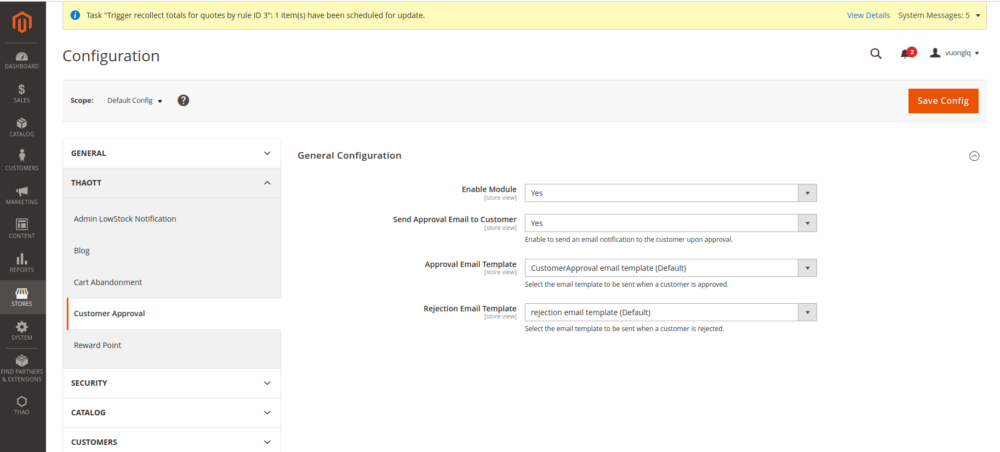
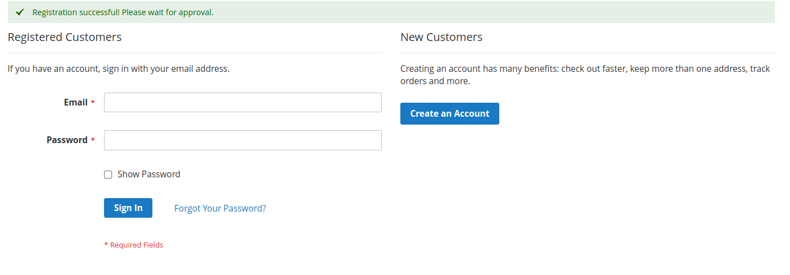
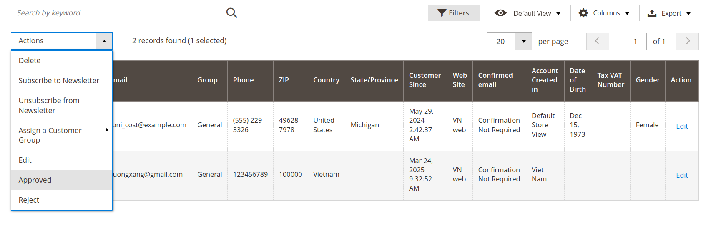
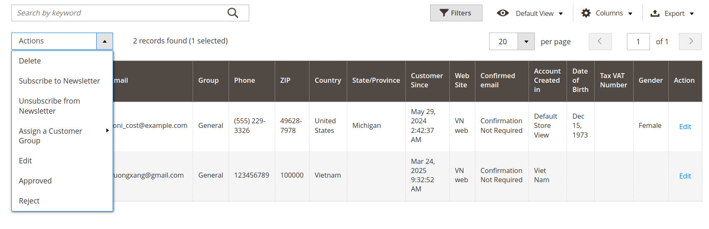

# Thao_CustomerApproval

Magento 2 module for managing customer account approvals.

## System Requirements

- Magento 2.4+
- PHP 7.4+

## Installation

### Install via Composer

1. Add the repository to Composer:
   ```sh
   composer config repositories.thao/module-customer-approval git https://github.com/Tothao/Thao_CustomerApproval.git
   ```
2. Install the module:
   ```sh
   composer require thao/module-customer-approval:dev-master
   ```
3. Run the following commands to enable the module:
   ```sh
   php bin/magento setup:upgrade
   php bin/magento setup:di:compile
   php bin/magento cache:flush
   ```

### Manual Installation

1. Clone the module from GitHub:
   ```sh
   git clone https://github.com/Tothao/Thao_CustomerApproval.git app/code/Thao/CustomerApproval
   ```
2. Run the following commands to enable the module:
   ```sh
   php bin/magento setup:upgrade
   php bin/magento setup:di:compile
   php bin/magento cache:flush
   ```
## Use Guide

To configure the module, go to **Admin > Configuration > Thaott > Customer Approval > General Configuration**.

### Available Settings:

- **Enable Module:** Enable/disable the module.
- **Send Approval Email to Customer:** Enable to send an email notification to the customer upon approval.
- **Approval Email Template:** Select the email template to be sent when a customer is approved.
- **Rejection Email Template:** Select the email template to be sent when a customer is rejected.



After create account success



How to approve customer: Admin > Customers > All Customers > Actions > Approved



How to Reject customer: Admin > Customers > All Customers > Actions > Reject



## Support

If you encounter any issues or have questions, please create an issue on the module's GitHub repository.

## License

This module is released under the MIT license.
